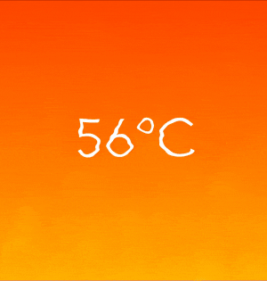

# HeatHazedImageView

Image view simulating refraction of light passing through heated air, i.e. heat haze or burning effect.



### Usage

1. Link HeatHazedImageView library to your project as Swift Package Manager dependency in Package.swift or using Xcode
```swift
dependencies: [
    .package(url: "https://github.com/peterminant/HeatHazedImageView.git", from: "1.0.1")
],
targets: [
    .target(name: "YourTarget", dependencies: ["HeatHazedImageView"])
]
```

2. Create view programatically or via Interface Builder
```swift
import HeatHazedImageView
...
let imageView: HeatHazedImageView!
```

3. Set animation parameters
```swift
imageView.speed = 200 // speed of rising air: min = 0, max = 1000
imageView.distortion = 500 // intensity of distortion effect: min = 0, max = 1000
imageView.isEvaporating = false // determines whether effect diminishes as the air rises to the top
```

4. Set source image
```swift
imageView.dataSource = .image(cgImage) // use CGImage
imageView.dataSource = .image(uiImage) // use UIImage
imageView.dataSource = .layer(caLayer) // render CALayer (e.g. CAGradientLayer) using screen scale
imageView.dataSource = .view(uiView) // render UIView (e.g. UILabel) using screen scale
```

5. Start / stop the animation
```swift
imageView.isPaused = false // false by default
```

6. Refresh source image if needed
```swift
label.text = "1"
imageView.dataSource = .view(label)
...
label.text = "2"
imageView.dataSource?.setNeedsDisplay()
```

### Requirements

Supported platforms are iOS 10.0 or later and tvOS 10.0 or later.
If Metal is not available on target device, HeatHazedImageView will fallback to using plain UIImageView without additional effects.
